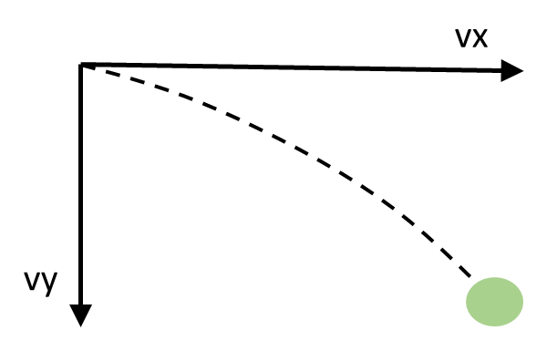

# BouncingBall
This code using OpenCV to generates and save a video of a ball bouncing across the screen. It then loads a video file of a bouncing ball, and detects the 2D location of the ball in each frame of the video using OpenCV methods. While iterating through the frames, it display the original frames in a single window overlaid with the marked location (bounding box) of the ball, and frame number written in a corner.

## How to run the code

**Step 1: Generates and saves a video (.avi file) of a ball bouncing across the screen**
```
python generate_ball.py [-h] [-c COLOR [COLOR ...]] [--vx VX] [--vy VY] [-l LENGTH] [-a ACCELERATION] [-t HEIGHT] [-w WIDTH]
```
Examples:
```
python generate_ball.py
python generate_ball.py -c 255 0 0 --vx 20 --vy 4 -l 50 -a 1 -t 680 -w 1040
```

**Step 2: Detect ball in the video generated by step 1**
```
python detect_ball.py
```

## Physics Assumptions/simplifications made:
The ball will be drop or throw to a box, it will bouncing until it will stop because of gravity. Moreover, I assuming that there is **no friction force**, which mean, when the ball stay on ground and not is bouncing anymore, it will continue move left and right with velocity vx.


## Some notes and expected failures:

- BUGs in platform of VScode-Windown Sub-System for Linux (WSL): Un-consistent key pressing. Because of this bugs, this code will not implement the feature "press q to quit while program on running". Please use Ctrl + C to quit during running.
https://stackoverflow.com/questions/67600528/opencv-waitkey0-triggers-without-keypress

- When you throw the ball so hard (vy large), such that it reach the roof. It will continue boucing forever. The reason is that, I didnot implement any force absorption at top border.

- The accelarator value should be divisors of vy, because we dont want to deal with float pixel